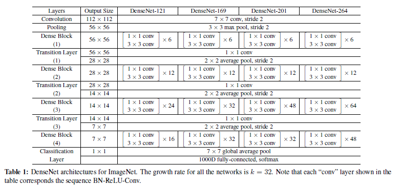

Author: pulpan92
# DenseNet
- - -

## 1. Related work
 - - -
 
Googlenet이 나온 이후  2015년 딥러닝 구조의 문제였던 degradation problem을 해결한 ResNet이 나왔다. 하지만 ResNet 이후 뚜렷한 모델의 변화가 없다가 이후 2017년 CVPR 컨퍼런스에 나온 네트워크 구조에 변화를 주는 모델이 DenseNet이다. 

## 2. Introduction
- - - 
ResNet의 연구에서 Convolution network는 input layer, output layer에 가까울수록 더 정확하고 효율적이라는 것이 증명되었다. 따라서 Densenet에서도 이같은 원리를 이용하였다.

일반적인 신경망에서와 달리 DenseNet에서는 L(L + 1) / 2개의 연결이 존재한다. 이에 대한 장점은 Degradation problem 해결, feature propagation 강화, 더 적은 parameter의 사용 등이 있다. 

## 3. Architecture

- - -

### Dense Connectivity

**ResNet**의 경우 이전의 layer 결과를 이후 layer에 더해주는 형태로 진행된다. 따라서 output에 대한 수식은 다음과 같이 정의된다.

**DenseNet**은 이전 layer의 결과를 concat하는 형태로 되어있다. 따라서 output에 대한 수식은 다음과 같다.

### Composite function
위에 나온 비선형 함수 ***H()*** 는 batch normalization (BN), ReLU, 3 8 3 Convolution layer로 결합되어 있다. 

### Pooling layers
위의 DenseNet 그림에서 Dense block 사이에 있는 Conv - Pooling layer는 **transition layer** 라고 칭하며 같은 Dense block에 있는 layer들은 모두 같은 feature map size를 갖게 된다. 

### Growth rate
수식 **H()l** 이 k개의 feature map을 형성한다고 하면 **l layer** 에서는 **k0 + k * (l - 1)** 개의 feature map을 형성하게 된다. 기존 모델들과의 차이점은 Densenet은 상당히 좁은 layer를 가지고 있으며 k를 **growth rate** 라고 칭한다. 

그리고 k값이 작아도 이전 정보의 feature map들을 효율적으로 전달하기 때문에 학습에는 충분하다고 나온다.

### Bottleneck layers

Dense block에서는 feature map이 쌓아지기 때문에 이에 대한 계산 복잡성이 높아진다. 따라서 feature map을 줄이는 부분이 들어가야 하는데 논문에서는 Bottleneck layer라고 칭한다. 

**BN -> ReLU -> Conv (1 \* 1) -> BN -> ReLU -> Conv (3 * 3)** 의 층을 Denseblock 사이에 넣어 feature map의 수를 줄이게 된다. **1 * 1 conv** 는 특정 맵에 대한 수를 줄이고 `4 * k`개의 feature map을 생성하도록 하였다. 이 후 **3 * 3 conv** 는 다시 채널을 growth rate만큼 줄이게 된다. 이 같은 Bottle neck layer는 `DenseNet-B`에 구현되어 있으며 그 결과는 실험 부분에 소개되어 있다.

### Compression

BN뿐만 아니라 `transition layer`에서도 feature map의 수를 줄일 수 있다. 만약 dense block에서 나온 결과의 feature map 갯수가 `m`이라고 한다면 이 layer를 거쳐 나온 feature map의 개수는 `pi * m`개가 된다. `pi`값은 우리가 지정해주는 하이퍼파라미터이며 `0 < pi < 1`의 값을 갖게 된다. 

실험에서는 일반적인 `DenseNet`에서는 `pi = 0.5`의 값을 지정하였으며 `BN layer`와 `transition layer`를 동시에 쓸 경우 **DenseNet-BC** 라고 표기하였다.

실제 ImageNet의 데이터를 사용한 모델의 구조는 위와 같다.
